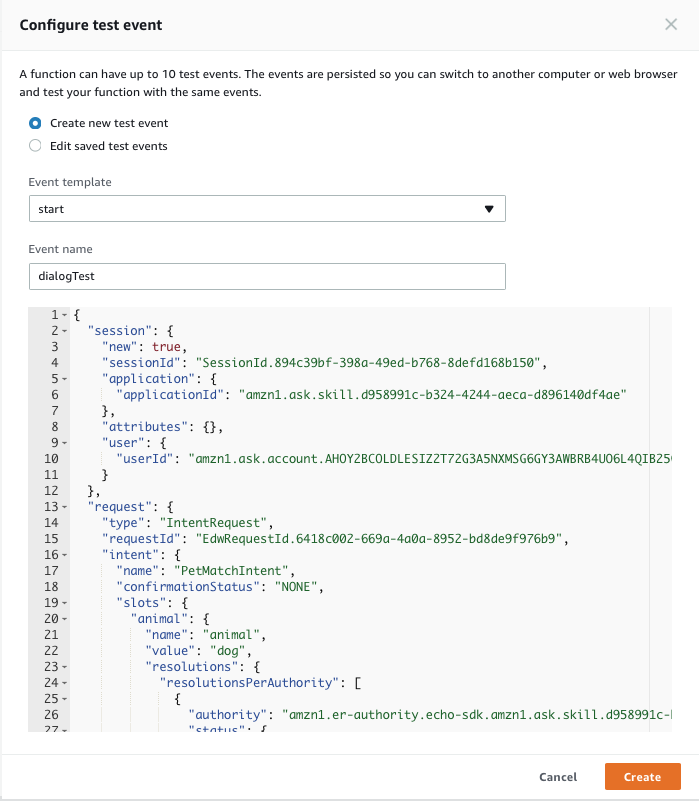

# Conversation and Memory

[](./1-build-and-customize.md)[](./2-entity-resolution.md)[](./3-memory.md)

## Part 1: Build and Customize Pet Match

**Overview:**

In Part 1 you'll create the Alexa skill called Pet Match. You'll set up the 
Voice User Interface (VUI) from a template, create the AWS Lambda Function that 
will respond to the requests from your Alexa skill's VUI, link the two together 
and test to make sure it works. The template will include animal, size, 
temperament, and shedding. You will add a new slot called energy and will 
delegate slot elicitation to Dialog Managment.

This tutorial assumes that you have never built an Alexa skill and will walk you
through the process with detailed instructions.

This section also includes extra credit. You will be challenged to add another 
slot called "location".

**Objectives:**

After completing this lab, you will be able to:

* Create and configure a new skill (VUI).
* Create and configure AWS Lambda (backend).
* Connect your VUI to your AWS Lambda.
* Test your skill using a variety of simulation tools.
* Configure Dialog Management and delegate slot elicitation.

## Task 1: Create the Voice User Interface

**Overview:**

In this step you will need your [Amazon Developer](https://developer.amazon.com)
Account. You will login to the developer portal and create the skill and VUI. 
For now you'll use the provided interaction model, to create the VUI. Later on 
in Task 5, you will update the VUI by adding a slot.

There's two parts to an Alexa Skill. The first part is the 
[Voice User Interface (VUI) ](https://developer.amazon.com/docs/custom-skills/define-the-interaction-model-in-json-and-text.html).
This is where we define how we will handle a user's voice input, and which code
should be executed when specific commands are uttered. The second part is the 
code logic for our skill, and we will handle that in Task 2.


3.  **On the Alexa page, choose the "Get Started" button for the Alexa Skills Kit.**

    <a href="https://developer.amazon.com/edw/home.html#/skills/list" target="_new"></a>

4.  **Select "Add A New Skill."** This will get you to the first page of your new Alexa skill.

    <a href="https://developer.amazon.com/edw/home.html#/skill/create/" target="_new"></a>

5.  **Fill out the Skill Information screen.**  Make sure to review the tips we provide below the screenshot.

    

    ### Skill Information Tips
    1.  **Skill Type** For this skill, we are creating a skill using the Custom Interaction Model.  This is the default choice.

    2.  **Language** Choose the first language you want to support.  You can add additional languages in the future, but we need to start with one.  (This guide is using U.S. English to start.)

    3.  **Name** This is the name that will be shown in the Alexa Skills Store, and the name your users will refer to.

    4.  **Invocation Name** This is the name that your users will need to say to start your skill.  We have provided some common issues developers encounter in the list below, but you should also review the entire [Invocation Name Requirements](https://developer.amazon.com/public/solutions/alexa/alexa-skills-kit/docs/choosing-the-invocation-name-for-an-alexa-skill).

        | Invocation Name Requirements | Examples of incorrect invocation names |
        | ---------------------------- | -------------------------------------- |
        | The skill invocation name must not infringe upon the intellectual property rights of an entity or person. | korean air; septa check |
        | Invocation names should be more than one word (unless it is a brand or intellectual property), and must not be a name or place | horoscope; trivia; guide; new york |
        | Two word invocation names are not allowed when one of the words is a definite article, indefinite article, or a preposition | any poet; the bookie; the fool |
        | The invocation name must not contain any of the Alexa skill launch phrases and connecting words.  Launch phrase examples include "launch," "ask," "tell," "load," and "begin."  Connecting word examples include "to," "from," "by," "if," "and," "whether." | trivia game for star wars; better with bacon |
        | The invocation name must not contain the wake words "Alexa," "Amazon," "Echo," or the words "skill" or "app." | hackster initial skill; word skills |
        | The invocation name must be written in each language you choose to support.  For example, the German version of your skill must have an invocation name written in German, while the English (US) version must have an invocation name written in English. | kitchen stories (German skill) |

    5.  **Audio Player** For this Trivia Skill, we won't be using any audio files, so you can select No for this option.  If you would like to learn more about adding audio to your skills, please check out our [Audio Player Guide](https://github.com/alexa/skill-sample-nodejs-audio-player).

4.  **Click the Next button to move to the Interaction Model.**

    

5.  Click on the **Launch Skill Builder** (Beta) button . This will launch the new Skill Builder Dashboard.

    

6.  Click on the "Code Editor" item under **Dashboard** on the top left side of the skill builder.


7.  In the textfield provided, replace any existing code with the code provided in the [Interaction Model](../interaction-model.json), then click "Apply Changes" or "Save Model".

8.  When your interaction model builds successfully, click on the **Configuration** button to move on to Configuration. In our next step of this guide, we will be creating our Lambda function in the AWS developer console, but keep this browser tab open, because we will be returning here on [Task 3: Connect VUI to your Lambda Function](#task-2-create-the-lambda-function).
     

     If you get an error from your interaction model, check through this list:

     *  **Did you copy & paste the provided code into the appropriate boxes?**
     *  **Did you accidentally add any characters to the Interaction Model or Sample Utterances?**

**Conclusion:**

At this point there should be check marks next to **Skill Information** and 
**Interaction Model**.

Does your screen look like this?


 If so, 🎉 congratulations! 🎉 You've completed Task 1! You
have learned how to create a skill, add intents, utterances, and slots, which 
means you have a VUI!

## Task 2: Create the Lambda Function

**Overview:**

You've built your VUI. Now it's time to build the Lambda Functions that will 
execute the commands that your VUI sends to it. In this task, you will log into 
[Amazon Web Services](http://aws.amazon.com) and create the Lambda Function. You 
can [read more about what a Lambda function is](http://aws.amazon.com/lambda), 
but for the purposes of this guide, what you need to know is that AWS Lambda is 
where our code lives.  When a user asks Alexa to use our skill, it is our AWS 
Lambda function that interprets the appropriate interaction, and provides the 
conversation back to the user.

1.  **Go to http://aws.amazon.com and sign in to the console.** If you don't already have an account, you will need to create one.  [If you don't have an AWS account, check out this quick walkthrough for setting it up](https://github.com/alexa/alexa-cookbook/tree/master/aws/set-up-aws.md).

    <a href="https://console.aws.amazon.com/console/home" target="_new"></a>

2.  **Click "Services" at the top of the screen, and type "Lambda" in the search box.**  You can also find Lambda in the list of services.  It is in the "Compute" section.

    <a href="https://console.aws.amazon.com/lambda/home" target="_new"></a>

3.  **Check your AWS region.** AWS Lambda only works with the Alexa Skills Kit in two regions: US East (N. Virginia) and EU (Ireland). Make sure you choose the region closest to your customers. During re:Invent, we ask that you set your region to EU (Ireland).

      

4.  **Click the "Create a Lambda function" button.** It should be near the top of your screen.  (If you don't see this button, it is because you haven't created a Lambda function before.  Click the blue "Get Started" button near the center of your screen.)

    

5.  **Choose the blueprint named "alexa-skill-kit-sdk-factskill".** We have created a blueprint as a shortcut to getting everything set up for your skill. You can search for a blueprint using the provided search box.  This blueprint adds the alexa-sdk to your Lambda function so that you don't have to upload it yourself.

      <!--TODO: THIS IMAGE NEEDS TO BE CUSTOMIZED FOR YOUR SKILL TEMPLATE. -->

6.  **Configure your trigger.** Click in the dashed box, and select Alexa Skills Kit from the list.  If you don't see Alexa Skills Kit in the list, jump back to step #3 on this page.

    

    Once you have selected Alexa Skills Kit, click the **Next** button.

7.  **Configure your function.** This screen is where we will enter the important parts of our Lambda function.  These values will only ever be visible to you, but make sure that you name your function something meaningful.  "SpaceFacts" is sufficient if you don't have another idea for a name.

    

8.  **Copy and paste the [provided code](../tree/feature/reinvent/labs/PetMatch/lambda/custom/index.js) into the Lambda function code box.**  We have provided the code for this skill on [GitHub](../tree/feature/reinvent/labs/PetMatch/lambda/custom/index.js).  Delete the contents of the code box, and paste the contents of the new code.

9.  **Set up your Lambda function role.**  If you haven't done this before, we have a [detailed walkthrough for setting up your first role for Lambda](https://github.com/alexa/alexa-cookbook/tree/master/aws/lambda-role.md).  If you have done this before, set your **Existing role** value to "lambda_basic_execution."

    

10. **For this guide, you can skip all of the Advanced settings.**  Click the **Next** button to move to the Review screen.

    

11. **The Review screen is a summary of your choices.  Click Create Function in the bottom left corner.**  You will need to scroll down to find **Create Function.**

    

12. **After you create the function, the ARN value appears in the top right corner. Copy this value for use in the next section of the guide.**

      <!--TODO: THIS IMAGE NEEDS TO BE CUSTOMIZED FOR YOUR SKILL TEMPLATE. -->

**Conclusion:**

Do you have an ARN number?  

If yes, 🎉 congratulations! 🎉 you've successfully created your Lambda Function,
which is your skill's backend! You can now have a VUI and a backend. Now's the
time to connect the two together so your skill can actually do something.

## Task 3: Connect VUI to your Lambda Function

**Overview:**

In Task 1 you created the Skill and it's VUI. In Task 2 you created the Lambda
Function. In this task you will connect the two so your skill will be able to
respond to user input. 

1.  **Go back to the [Amazon Developer Portal](https://developer.amazon.com/edw/home.html#/skills/list) and select your skill from the list.** You may still have a browser tab open if you started at the beginning of this tutorial.

2.  **Open the "Configuration" tab on the left side.**

    

3.  **Select the "AWS Lambda ARN" option for your endpoint.** You have the ability to host your code anywhere that you would like, but for the purposes of simplicity and frugality, we are using AWS Lambda. ([Read more about Hosting Your Own Custom Skill Web Service](https://developer.amazon.com/public/solutions/alexa/alexa-skills-kit/docs/developing-an-alexa-skill-as-a-web-service).)  With the AWS Free Tier, you get 1,000,000 free requests per month, up to 3.2 million seconds of compute time per month. Learn more at https://aws.amazon.com/free/.  In addition, Amazon now offers [AWS Promotional Credits for developers who have live Alexa skills that incur costs on AWS related to those skills](https://developer.amazon.com/alexa-skills-kit/alexa-aws-credits).

    

4.  **Select "North America" or "Europe" as your geographical region.** IMPORTANT: Make sure you select the same region that you created your Lambda in.  Remember, Alexa skills using AWS Lambda can only run in N. Virginia (North America) and Ireland (Europe).

    

5.  **Paste your Lambda's ARN (Amazon Resource Name) into the textbox provided.** It should look similar to the screenshot above.

6.  **Leave "Account Linking" set to "No."** For this skill, we won't be using Account Linking, but you can learn more about [Linking an Alexa User with a User in Your System.](https://developer.amazon.com/public/solutions/alexa/alexa-skills-kit/docs/linking-an-alexa-user-with-a-user-in-your-system)

7.  **Click the "Next" button to continue to page #4 of this guide.**

    [](./4-testing.md)

**Conclusion:**

At this point you should now have successfully linked your VUI to your Lambda 
Function and there should be a check mark next to **Skill Information**, 
**Interaction Model**, and **Configuration**

Does your screen look like this?


If so, 🎉 congratulations! 🎉 You have succesfully linked your VUI to your code.
You're now ready to try testing your skill! In just a few minutes you'll be able
to speak to your skill and hear a response!

## Task 4: Test

**Overview:**

In Task 1 you created the VUI, in Task 2 you created your Lambda Function and in
Task 3 you linked them together. You're now ready to test your skill! In this
task you'll learn how to do just that.

1.  **Go back to the [Amazon Developer Portal](https://developer.amazon.com/edw/home.html#/skills/list) and select your skill from the list.** You may still have a browser tab open if you started at the beginning of this tutorial.

2.  **Open the "Test" tab on the left side.**

    

3.  **Understand the voice simulator.** While it's not specific to your skill, 
the Voice Simulator is a valuable testing tool for every skill. Type a word into
the box, and click the "Listen" button to hear how Alexa will pronounce it. To 
make changes to her pronunciation, use Speech Synthesis Markup Language 
[(SSML)](https://developer.amazon.com/public/solutions/alexa/alexa-skills-kit/docs/speech-synthesis-markup-language-ssml-reference) 
to modify how Alexa will interpret text to speech. Try these examples:

    ```html
    <say-as interpret-as="number">12345</say-as>
    ```

    ```html
    <say-as interpret-as="ordinal">12345</say-as>
    ```

    ```html
    <say-as interpret-as="digits">12345</say-as>
    ```

    

    Return to the Voice Simulator as needed to ensure that Alexa says words and 
    phrases as you would expect.

4.  **Test your skill with the Service Simulator.** To validate that your skill 
is working as expected, use the Service Simulator.  In the **Enter Utterance**
 text box, type "open pet match"

      <!-- YOU NEED TO MAKE YOUR OWN VERSION OF THIS IMAGE.  -->

    ### Service Simulator Tips
    * After you click the "Ask [Your Skill Name]" button, you should see the **Lambda Request** and **Lambda Response** boxes get populated with JSON data like in the screenshot above.
    * Click the **Listen** button in the bottom right corner to hear Alexa read the response.

    * If you receive a response that reads: *"The remote endpoint could not be called, or the response it returned was invalid,"* this is an indication that something is broken.  AWS Lambda offers an additional testing tool to help you troubleshoot your skill.

5.  **Configure a test event in AWS Lambda.** Now that you are familiar with the **request** and **response** boxes in the Service Simulator, it's important for you to know that you can use your **requests** to directly test your Lambda function every time you update it.  To do this:
    1.  Enter an utterance in the service simulator, and copy the generated Lambda Request for the next step.

    2.  **Open your Lambda function in AWS, open the Actions menu, and select "Configure test events."**

        

    3.  **Select "Create New Test Event". Choose "Alexa Start Session" as the Event Template from the dropdown list.** You can choose any test event in the list, as they are just templated event requests, but using "Alexa Start Session" is an easy one to remember.  

        

    4.  **Type in an Event Name into the Event Name Dialog box. Delete the contents of the code editor, and paste the Lambda request you copied above into the code editor.** The Event Name is only visible to you. Name your test event something descriptive and memorable. For our example, we entered an event name as "dialogTest". Additionally, by copying and pasting your Lambda Request from the service simulator, you can test different utterances and skill events beyond the pre-populated templates in Lambda.

        

    5.  **Click the "Create" button.** This will save your test event and bring you back to the main configuration for your lambda function.

    6.  **Click the "Test" button to execute the "dialogTest" test event.**

        

        This gives you visibility into four things:

        *  **Your response, listed in the "Execution Result."**

           

        *  **A Summary of the statistics for your request.** This includes things like duration, resources, and memory used.

           

        *  **Log output.**  By effectively using console.log() statements in your Lambda code, you can track what is happening inside your function, and help to figure out what is happening when something goes wrong.  You will find the log to be incredibly valuable as you move into more advanced skills.

           

        *  **A link to your [CloudWatch](https://console.aws.amazon.com/cloudwatch/home?region=us-east-1#logs:) logs for this function.**  This will show you **all** of the responses and log statements from every user interaction.  This is very useful, especially when you are testing your skill from a device with your voice.  (It is the "[Click here](https://console.aws.amazon.com/cloudwatch/home?region=us-east-1#logs:)" link in the Log Output description.)

6.  **Other testing methods to consider:**

    *  [Echosim.io](https://echosim.io) - a browser-based Alexa skill testing tool that makes it easy to test your skills without carrying a physical device everywhere you go.
    *  [Unit Testing with Alexa](https://github.com/alexa/alexa-cookbook/tree/master/testing/postman/README.md) - a modern approach to unit testing your Alexa skills with [Postman](http://getpostman.com) and [Amazon API Gateway](http://aws.amazon.com/apigateway).


**Conclusion:**

Congratulations, at this point you've built a functional skill 🎊!!! Now we are 
going to add support for a new slot to be elicited by dialog management.

## Task 5: Activate Dialog Management

**Overview:**

In this task you will activate Dialog Management. To test you will want to use 
a device or [echosim.io](http://echosim.io)

1.  **Make the slots required**
    1.  **Go to the [Amazon Developer Portal](http://developer.amazon.com)** click on **PetMatchIntent**. 
    2.  To the left you will see the list of **Intent Slots**  
        
    3.  **Click on the checkbox next to the animal slot**. This will make the slot required which activates Dialog Management. 
    If the user doesn't provide the animal slot, your skill automatically prompt the user, however, we're not done yet. We still 
    have to add prompts to the VUI that the skill will use to prompt the user.
    4.  **Click on animal** and the animal slot should appear.  
          
        On this page you will see two things:

        *  **Prompts**
            These are the prompts that your skill will use to automatically prompt the user for the selected slot.
            Note that you can use slots in the prompts. For example, the prompt "Would you like a {size} cat or dog" 
            would be filled with the **{size}** slot value. If the user said, "I want a big one" your skill would say,
            "Which would you like a big cat or dog?"  
            
        *  **Utterances**
            The utterances are how the user will respond to the prompt and are based on the current slot. 
            For example, "I want a {animal}" will allow the user to fill the slot by saying, "I want a dog".
            Once nice feature is that you provide multiple slots per utterance. 
            "I want a {size} {temperament} {animal} that {shedding}" will allow the user to single-shot the 
            reply. You should try to cover all the combinations for each required slot's utterances so the
            user doesn't have to repeat the same answer over and over.  
            
    5.  **Repeat the steps 3 and 4** for the **size**, **temperament**, and **shedding** slots.

**Conclusion:**

Are all 4 slots required? Does your model save and build? When you open pet match, does your skill 
prompt you for missing slots? If so then congratulations!🎊 You've finished Part 1!

## Extra Credit

* **Add more utterances to each of your slots** When using Dialog Management,
you the more sample utterances you have per slot the more flexible your VUI 
becomes. For example, for your **animal** slot if you add "I want a {size} 
{temperament} {animal} " as an utterance, when prompted for the **animal** slot,
the user could reply, "I want a big mean dog", and your skill will automatically
capture all of the slot values. You can also have the slot be the utterance. For
example, "{animal}" is valid and allows the user to answer "dog". You can even
add "{size}" as an utterance so if the user answers "big" although they were 
prompted for an **animal**. If you provided a "{size}" utterance for your 
**animal** slot, then your skill will capture "big" into the **size** slot and 
reprompt for **animal**

[](./2-entity-resolution.md)