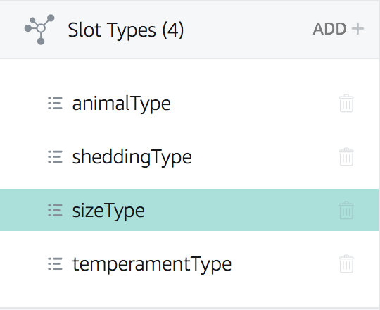
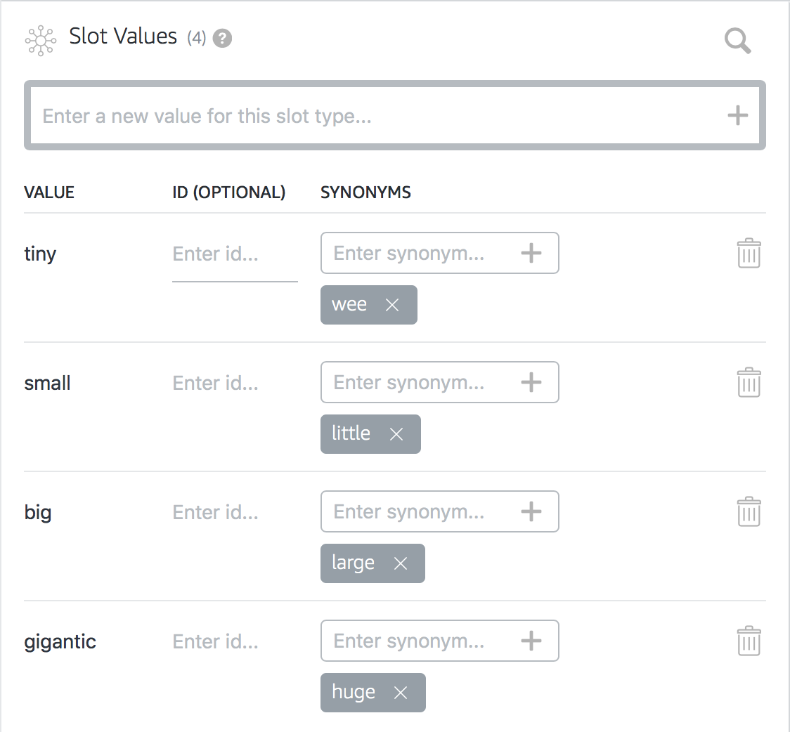
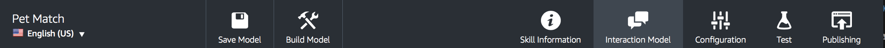
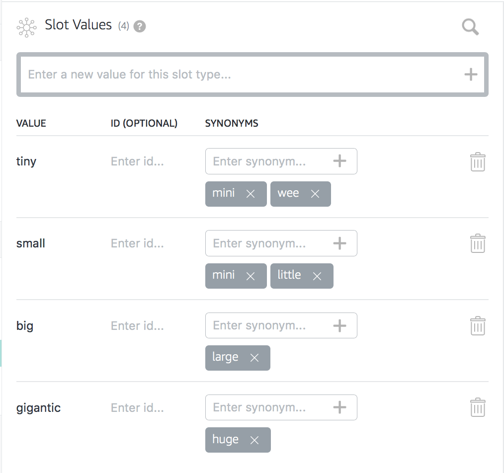
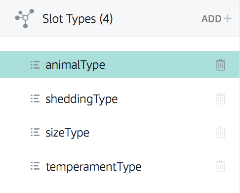
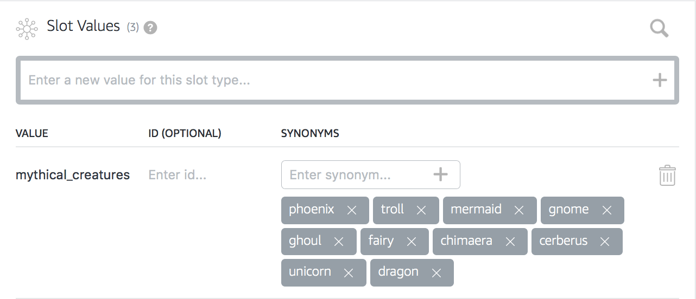

# Conversation and Memory

## Part 2: Entity Resolution

**Overview:**

In part 2 you will learn how to make your VUI more robust by mapping synonyms to
your slot values. Synonyms are great for adding flexibility to your skill's VUI, 
however, sometimes a synonym can map to more than one value causing ambiguity. 
You'll learn how to identify when a synonym has been mapped to more than one 
value and how to use dialog management to disambiguate through clarifying with 
the user. Lastly, you'll leverage synonyms for front-end error detection. This 
allows you to leverage the power of Alexa's natural language understanding to 
determine if the user gave you valid input.

**Objectives:**

After completing this lab, you will be able to:

*  Add Synonyms
*  Prompt the User for clarification when a synonym maps to more than one value.
*  Configure and leverage synonyms to validate input.

## Task 1: Add Synonyms

**Overview:**

In this task, you will learn how to add synonyms to your custom slot types. 

1.  Go to the skill builder.
2.  In **Slot Types** Menu find **sizeType** and click on it.  
        
    
    You'll see a table with three columns, **VALUE**, **ID** AND **SYNONYMS**.
3.  For each **VALUE**, add the following synonyms:  
      
4.  Once you've entered all the synonyms, click on **Save Model**, then click 
    **Build Model**.  

    
    **Note:** Every time you make a change to the VUI, you will need to click 
    **Build Model**. 
5.  Now it's time to test your skill. Say "Alexa, open pet match" and when asked
    for your **size** preference answer using one of the **synoynms** that you 
    just entered.

**Conclusion:**

Did your skill resolve the synonym to the value properly? Did you get a match? 
If so, 🏆congratulations🏆! You've completed this task! How does this work? 
There's two pieces at play here. Through your VUI, you've provided training data
to the Alexa engines to map these **synonyms** to the **values**. In your Lambda 
Function, you're given a lot of information about your slots including wether it
was a successful match or not. If you have a successful match you'll see 
`ER_SUCCESS_MATCH` likewise, if no match you'll see `ER_SUCCESS_NO_MATCH`. This
allows you to determine if the user said something that resolved to the 
**value**, yet isn't a **synonym**. The extra credit section will challenge you 
to think about how to handle an `ER_SUCCESS_NO_MATCH`. In the next section,
you'll learn how to handle a **synonym** that resolves to more than one
**value**.

## Task 2: Disambiguation

**Overview:**

For this task, you will be adding a **synonym** that maps to more than one 
**value**. When the user says that **synonym** your skill will need to seek 
clarification from the user. 

1.  Go to the skill builder.
2.  In **Slot Types** Menu find **sizeType** and click on it.  
        
    
    You'll see a table with three columns, **VALUE**, **ID** AND **SYNONYMS**.  
3.  In the **SYNONYMS** box for **tiny** and **small** add **mini**.  
      
4.  Once you've added **mini** as a **synonym** to both **tiny** and **small**,
    click on **Save Model**, then click **Build Model**.    
      
    Once your skill has finshed buidling, you're ready to test.
5.  Test your skill by saying, "Alexa ask pet match for a mini dog". 

**Conclusion:**

Did the skill prompt you for clarification? If so, 🏆congratulations!🏆 You've 
finished this task! In your Lambda Function, take a close look at 
`disambiguateSlot()`. It loops through all the slots to identify matches with
more than one value. If the status code for the slot is `ER_SUCCESS_MATCH`, and 
the **values** array is greater than 1 then you know that the synonym resolves 
to more than one value. To ask the user for clarification, you build up a prompt
and then emit `:elicitSlot`.

In the next section you'll learn how to use the Entity Resolution to validate 
input.

## Task 3: Front-end Data Validation

**Overview:**

For this task, you'll learn how to use Entity Resolution to validate input. Pet
Match is a skill designed to match the user with a real pet, however, there's 
nothing stopping the user from asking for a mythical creature such as a unicorn,
or a dragon. 

1.  Go to the skill builder.
2.  In **Slot Types** Menu find **animalType** and click on it.  
        
    
    You'll see a table with three columns, **VALUE**, **ID** AND **SYNONYMS**.  
3.  In the box that says, **Enter a new value for this slot type...** type 
    **mythical_creatures** and either click the **+** button or hit the 
    **enter key** on your keyboard.
4.  Add the following **syononyms** to your **mythical_creatures** value.  
    
5.  Once you've added all the **synonyms** click on **Save Model**, then click 
    **Build Model**.    
      
    Once your skill has finshed buidling, you're ready to test.
6.  Test your skill by saying, "Alexa, ask pet match for a dragon"

**Conclusion:**

Did the skill answer with a funny response? If so then 🏆congratulations!🏆 
You've finished task 3 and part 2 of the workshop! Great job!

We were able to identify that the user said a mythical creature because we added
them as **synonyms** to our VUI. In the Lambda Function we are checking 
`slotValues.animal.resolved`. Since it was equal to `'mythical_creatures'` 
instead of using the pet api to look for a match, we returned a random funny 
response.

## Extra Credit

* **Log ER\_SUCCESS\_NO\_MATCH** When you get an **ER\_SUCCESS\_NO\_MATCH** 
your slot received a value, but there was no match. There's a possibility 
that the value is valid, but you didn't account for it by adding a **synonym**. 
You should log a `ER_SUCCESS_NO_MATCH` so you can add missing **syonyms** to 
your VUI. Come up with a way to log `ER_SUCCESS_NO_MATCH` for all slots.

