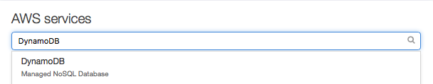
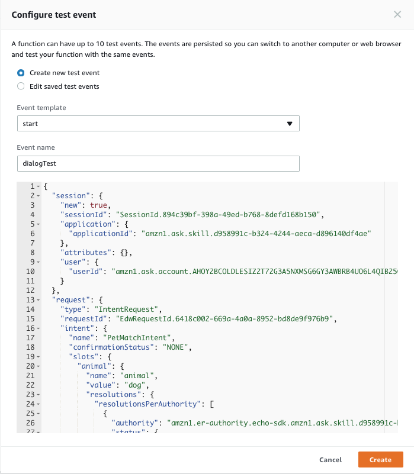
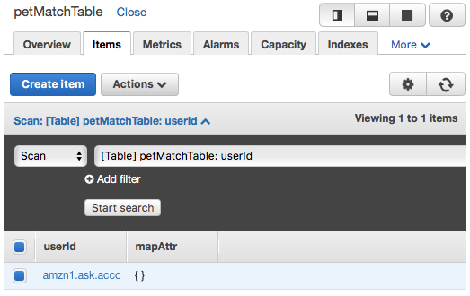
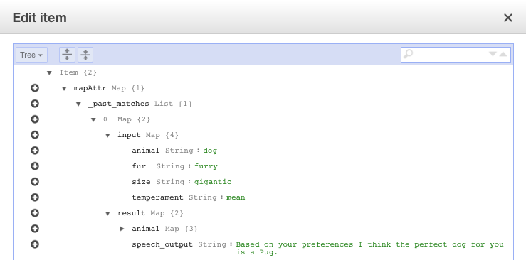

# Conversation and Memory

[](./1-build-and-customize.md)[](./2-entity-resolution.md)[](./3-memory.md)

## Part 3: Memory

**Overview:**

In part 3 you will learn how to access your skill's memory that's been stored in
an external web service. Using the provided helper functions you'll call the Pet
API and have Alexa speak the results back to the user and learn how to render a 
card with an image of the dog breed that the user was matched with. You'll also
learn how to configure AWS Identity Access Management (IAM) so your Lambda 
Function can write to DynamoDB and store a user's match results.

The extra credit in this section will challenge you to add an utterance for 
checking a user's past matches and recovering from a failure accessing your web
service.

**Objectives:**

After completing this lab, you will be able to:

*  Use Javascript ES6 promises to make an external web service call.
*  Render a card containing an image that displays in the companion app.
*  Configure IAM roles to allow access to DynamoDB from your skill.
*  Leverage the SDK to create a DynamoDB table from your skill.
*  Save, update, and delete items stored the DynamoDB table.

## Task 1: Make a Web Request

**Overview:**

Since the code is already set up to make a 'GET' request over 'HTTPS', in this 
task we'll cover what's going on. We are using **ES6 Promises** to make an 
**HTTP GET** request. While you don't need to know everything about promises in 
order to use them, you should familiarize yourself with them. One great thing 
about promises is the ability to chain asynchronus calls so you no longer have
nested callbacks.


**Conclusion:**

Using promises to make a web request is pretty simple. The extra credit for this
section will challenge to recover gracefully from a failure upon calling your 
external API using the `catch` function.

## Task 2: Render a Card

**Overview:**

In the previous task you made and webservice call to the Pet Match API and got
the match results. The payload includes links to images of the matched dog
breed that are stored in an S3 bucket. In this task, you will learn how to
render a card that will appear in the companion app and on an echo device 
with a screen. You'll uncomment the link of code that looks like, 
``// this.response.cardRenderer('Your pet match is ...', `A ${response.result.animal.name}`, response.result.animal.images);``
    
1.  Open a browser to the [AWS Console](https://aws.amazon.com/console). Or, 
simply go to that tab if you've still got it open, then click 
the aws logo in the top left corner to return to the AWS main page.
2.  Find the line of code ``// this.response.cardRenderer('Your pet match is ...', `A ${response.result.animal.name}`, response.result.animal.images);``
3.  Uncomment this line by removing the first two ```//``` characters.
4.  Scroll up and click the "Save" button.
5.  Click Test.  
6.  Now test your skill on the device or [echosim.io](http://echosim.io).

**Conclusion:**

Open up the Alexa Companion App ([iOS]()|[Android]()) and check to see if 
there's a **Pet Match** card and displays an image of a dog. If so then 
🏆 congratulations 🏆 you've successfully rendered a card.  The 
`this.response.cardRender` takes in 3 parameters:

*  Card Title
*  Card Body
*  Image Object  
        The image object contains small and large image url. The SDK will
        choose the right image based upon where it's being used. Our web
        service call conveniently has an object called images that is in
        the format that `this.response.cardRenderer` understands so we 
        simply pass it on through.  The object looks like:
        
	    {
		    "smallImageUrl": "",
		    "largeImageUrl": ""
	    }

      **Note:** For simplicity, the URLs have been removed. Normally you'd see a
      URL between the quotation marks.

Now that you have an understanding of how to make an http get request to an 
external API as well as how to render a card, you will now learn how to save the
results of the match into DynamoDB.


## Task 3: Add DynamoDB to IAM Role

**Overview:**

For this task, you will set up your Lambda Function's IAM role so it can read 
and write to DynamoDB.

When you create a new skill, the default permissions are set to the 
lowest-needed to run a basic skill. We want our skill to do more, so we will 
need to add the permission to have full access to DynamoDB.
Once our database is configured, we can have our skill prompt the user to 
continue with the next step when re-launching the skill.

We will need to prepare our skill's Lambda function to use a database called 
[DynamoDB](https://aws.amazon.com/dynamodb/).

If you've never done this before or need a refresher, follow the steps below 
which walk you through how to enable permission for a database before we define 
it within our Lambda function. If you're comfortable doing this on your own, go 
ahead and move on to Task 3 once you've added the permission.

#### Configure Permissions for DynamoDB

1.  Open a browser to the [AWS Console](https://aws.amazon.com/console). Or, 
simply go to that tab if you've still got it open, then click the aws logo in 
the top left corner to return to the AWS main page.
2.  In the search box titled **AWS services**, type `IAM` then click the 
option reading **IAM** (Manage User Access and Encryption Keys)
3.  On the new page reading **Welcome To Identity and Access Management** your 
navbar to the left should have an option called **Roles**. Click that.
4.  On this page, you should see the name of your standard Lambda role, 
`lambda_basic_execution`. Click the role name.
5.  In the **Permissions** tab, under "Managed Policies", click the blue button
 titled "Attach Policy"
6.  In the filter field, type "dynamo" and then locate the policy named 
`DynamoDBFullAccess` and click the checkbox.
7.  Click "Attach Policy"

**Conclusion:**

At this point, your skill has access to read and write to DynamoDB. In the next 
task you will enable the database and write to it.

## Task 4: Enable Database

**Overview:**

Now that we've added permission to our database, it's time to enable it within 
our Lambda function. In the source code provided, uncomment the line that looks 
like this: ```// alexa.dynamoDBTableName = 'petMatchTable'; ``` Again, if you 
are familiar with this process or understand what you just did, move on to the 
next task. If not, refer to the section below.

#### Enable the table within your Lambda code

1.  Review your Lambda function code within the AWS Lambda console.
2.  Locate the line `// alexa.dynamoDBTableName = 'petMatchTable'; `  
  **Note** The next time you run your skill, the **petMatchTable** will 
  automatically be created for you. 
3.  Uncomment this line by removing the first two `//` characters.
4.  Scroll up and click the "Save" button.
5.  Click Test.  
6.  Open the skill using [echosim.io](https://echosim.io). Once it's up and 
ready, answer all the prompts until you get a match. You may encounter errors 
the first couple of times the skill runs.  This is okay.  The skill code is 
setting up a new table in DynamoDB which may take 60 seconds to complete.
7.  To view the contents of your table:
    1.   Go to the [AWS Console](http://console.aws.amazon.com) and enter 
    **DynamoDB** into the search box.  
        

    2.  Click on **DynamoDB Managed NoSQL Database**
    3.  Click on **Tables** located on the upper left of the page.  
    4.  Click on **petMatchTable**
    
        
	
    5.  Click on **Items**
    
        
	
    6.  Click on the user id that looks like **amzn1.ask.account** the following
    modal will appear:     
        
	
    7.  Click on **mapAttr** > **\_past_matches** > **input** > **result** to see 
    what was stored in **DynamoDB**.  
    **Note:** The that **userId** column was automatically created. Since we are 
    using the session to store information into **DynamoDB**, the saved data is 
    automatically with the user that invoked the skill. That way you can keep 
    **user a**'s data separate from **user b**'s data.
8. Now that we've confirmed that our skill is writing to **DynamoDB** let's take
a step back and see how we save, update, and delete from the database. 
  1.  **Save**  
    To save to the database, all you need to do use the session attributes.
    `this.attributes['foo'] = 'bar';` will set 'foo' to 'bar'. Session 
    Attributes are available as long as the skill is active. Once it exists they
    are purged from memory. You can think of it as short-term memory. When you 
    enable **DynamoDB** the data is automatically saved upon exiting the skill.
  2.  **Update**  
    To update a value, all you need to do is set the session attribute to a new
    value. `this.attributes['foo'] = 'new_value';` will overwrite what was 
    previously set.
  3.  **Delete**  
    To delete from the database, simply use the `delete` operator. 
    `delete this.attributes['foo']` will delete the attribute 'foo'.

**Conclusion:**

Does your DynamoDB table contain **\_past_matches**? If so, 🎉congratulations🎉!
You have completed this task and you've also completed the entire workshop! At 
this point you should be able to:

*  Create and configure a skill.
*  Create an AWS Lambda Function.
*  Connect your VUI to your Lambda Function.
*  Test your skill on a device and with [echosim.io](http://echosim.io).
*  Configure Dialog Management.
*  Add Synonyms to your custom slot types.
*  Prompt the user to disambiguate synonyms that map to more than one value.
*  Configure and leverage synonyms to validate input.
*  Use ES6 promises to make an external webservice call.
*  Render a card containing an image that displays in the campanion app.
*  Configure IAM roles to allow access to DynamoDb from your skill.
*  Leverage the SDK to create a DynamoDB table from your skill.
*  Save, update, and delete items stored in the DynamoDB table.

## Extra Credit

1. **Add a past match utterance/intent to your skill** Now that you have a basic 
understanding of how this skill works and added the ability to save the user's
matches to **DynamoDB** it would be good to provide the user with a feature that
enables them to ask your skill for their past matches. 
  1.  In the Skill Builder create an intent called **PastMatchIntent**.
  2.  Add a few sample utterances for example "past matches".
  3.  Update your Lambda Function so it can respond to **PastMatchIntent**.
  4.  Read the past matches from **DynamoDB**. You'll want to consider how to 
  handle the following cases: 
    *  No past matches.
    *  More than 3 matches.
2.  **Recover gracefully from a failure to connect to the Pet Match API** Web 
services are awesome. You can pull in data from a bunch of sources, combine it
all together, process it and use it your skill, however, there are some cases 
where the API that you're trying to access is unreachable. While there are too 
many reasons to list why it's a best practice to gracefully recover. Think about
it from the user's perspective. They are eagerly awaiting their match but your 
service is down. You should probably apologize and remember the slots that they 
gave you so you can look it up next time they use the skill. In your 
**index.js** file look for the comment that says, `// Part 3 Extra Credit 2:`.
Read the hints in the comments to get a head start. You'll need to force a 
failure. One way to do that is to find the line:  
    ```HOSTNAME: 'osvx4f8rrg.execute-api.us-east-1.amazonaws.com',```  
and change it to:  
    ```HOSTNAME: '', // 'osvx4f8rrg.execute-api.us-east-1.amazonaws.com', ```  
Doing so will break the request because the host name is blank. You'll want to 
leave the comment with the actual url in place so you can easily add the correct 
**HOSTNAME** back when you're done.
